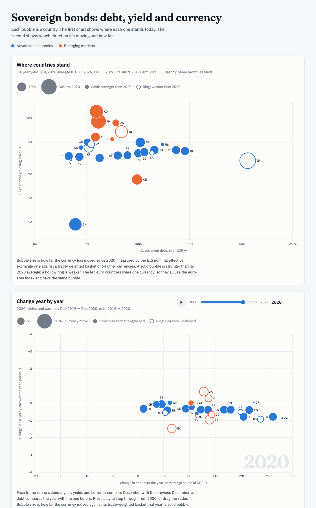

# Sovereign bond charts

Two interactive bubble charts comparing 27 countries' government bond yields, debt-to-GDP and currency strength.

**Live site:** https://mcrrobinson.github.io/sovereign-bond-charts/



1. **Where countries stand**: debt-to-GDP (x) against 10-year bond yield (y, log scale). Bubble size is how far the currency has moved since 2020: solid means stronger, a ring means weaker.
2. **Change year by year**: each year's change in debt-to-GDP (x) and 10-year yield (y), from 2000 to the current year. Press play to animate through the years or drag the slider; `?year=2011` opens a given year. Bubble size is how far the currency moved that year: solid means it strengthened, a ring means it weakened.

Blue bubbles are advanced economies and orange bubbles are emerging markets. Hover over or tab to a bubble for exact figures; the full data is in the table at the bottom of the page.

## Data

All three sources are free public APIs with no key.

| Variable | Source | Frequency |
|---|---|---|
| 10-year government bond yield | [OECD](https://data-explorer.oecd.org/) Main Economic Indicators, long-term interest rates (`DF_FINMARK`, `IRLT`) | Monthly average |
| Currency strength | [BIS](https://data.bis.org/topics/EER) nominal effective exchange rate, broad basket of 64 economies (`WS_EER`, `M.N.B`), 2020 = 100 | Monthly |
| Government debt, % of GDP | [IMF](https://www.imf.org/external/datamapper/GGXWDG_NGDP@WEO) World Economic Outlook, general government gross debt (`GGXWDG_NGDP`) | Annual |

**Currency strength** is the BIS nominal effective exchange rate: a currency's value against a trade-weighted basket of its trading partners' currencies. It is a better measure than a rate against the US dollar alone because it reflects the currency's value against all the others it trades with. The ten euro members all use the euro-area index. BIS also publishes a separate index per euro country, but each one weights the euro by that country's own trade partners, so the same currency would appear to move by different amounts (for example Greece +2.0% a year vs Italy +1.1% over 2021–2026).

**Yearly changes** are in percentage points for yields and debt, and % for currency. Yields and currency compare each December with the previous December; debt compares each IMF year with the one before. The current year runs from December to the latest month, and its debt figure is the IMF forecast. The axes are fixed across years so bubbles can be followed; the few country-years beyond them (Greece and Portugal in 2010–13, Ireland's 2015 GDP revision, Colombia in 2005 and 2022) are pinned to the edge with an arrow. Countries appear once their yield series starts: India in 2012, China in 2015.

### Limitations

- Yields are monthly averages published with a lag of about a month, so they can differ from today's market quote.
- The latest debt year is an IMF estimate, not a final figure.
- Brazil, Turkey, Singapore and Indonesia are left out. OECD's Brazil series is not the nominal 10-year yield, and there is no current free series for the other three.

## Updating the data

A [GitHub Action](.github/workflows/update-data.yml) runs `scripts/fetch_data.py` every Monday and commits `data/data.json` when the figures change. To run it by hand:

```sh
python3 scripts/fetch_data.py   # standard library only, Python 3.9+
python3 -m http.server          # then open http://localhost:8000
```

To add a country, add a row to `COUNTRIES` in `scripts/fetch_data.py`. The script stops with an error if any source has no data for it.
